# Manual de Usuario Piolify

## 🚀 Ejecución

Para iniciar la aplicación, se debe ejecutar la clase `Login`, ubicado en el paquete `umu.pds.vista` del repositorio. Una vez lanzada la aplicación, se muestra la siguiente ventana:  

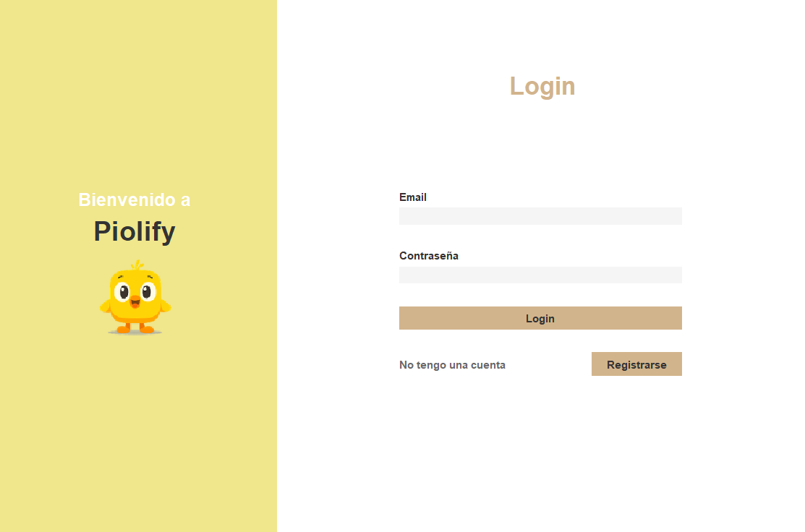
  

En esta pantalla, el usuario debe introducir sus credenciales (correo electrónico y contraseña) para tener acceso total a la plataforma. Si es la primera vez que ha iniciado la aplicación, lo más probable es que no tenga una cuenta de usuario. Para registrarse en Piolify, se debe pulsar el botón **Registrarse**, redirigiéndolo al formulario de registro.

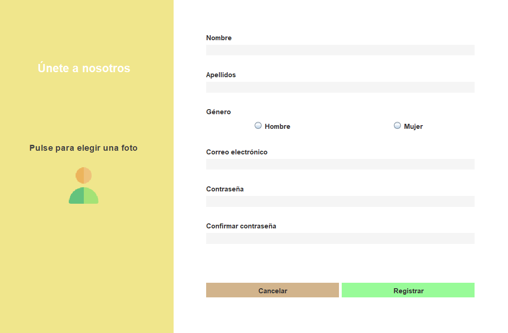

Para registrarse, debe rellenar todos los campos del formulario y, opcionalmente, proporcionar una foto de perfil. Una vez se haya registrado exitosamente, su cuenta queda registrada y podrá iniciar sesión, a partir de la ventana **Login** mostrada anteriormente.

## 🏠 Ventana Principal de Piolify

La aplicación se divide en cuatro secciones:

- [**Mis Cursos**](#mis-cursos): Biblioteca interna del usuario.
- [**Estadísticas**](#estadísticas): Consulta de estadísticas y logros obtenidos por el usuario.
- [**Amigos**](#amigos): Sección social de la plataforma.
- [**Mi perfil**](#mi-perfil): Gestión de la información personal del usuario.

### 📚 Mis Cursos

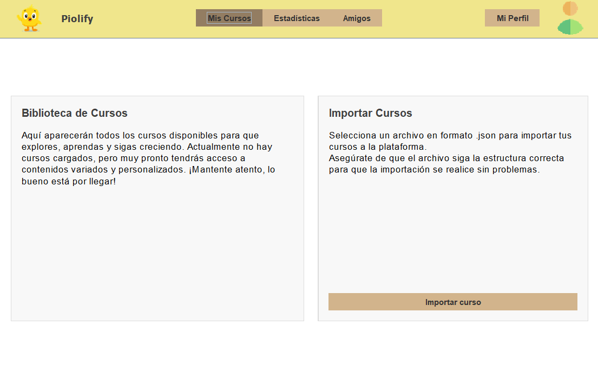

Es la sección por defecto al iniciar sesión en Piolify. El usuario es capaz de:

- Importar nuevos cursos en formato  `.json` mediante el botón [**Importar curso**](#importar-cursos).
- Acceder a todos los cursos que ha importado anteriormente. Si no se tienen cursos cargados, se muestra un mensaje por defecto.

### 📊 Estadísticas

Permite al usuario visualizar un resumen de su actividad dentro de la plataforma, ideal para un mejor seguimiento del progreso de su aprendizaje. Esta sección muestra:

- Un **Resumen General**, con estadísticas acumuladas de todas las sesiones de aprendizaje realizadas por el usuario. Muestra:
  - La racha actual de días consecutivos completando **al menos** una sesión de aprendizaje.
  - La mejor racha de días consecutivos completando al menos una sesión de aprendizaje.
  - El tiempo total de estudio.
  - El número de ejercicios que ha completado el usuario.
  - El porcentaje promedio de aciertos.
- Los **Logros Obtenidos** por el usuario durante las sesiones de aprendizaje.
- El **Progreso por Cursos**

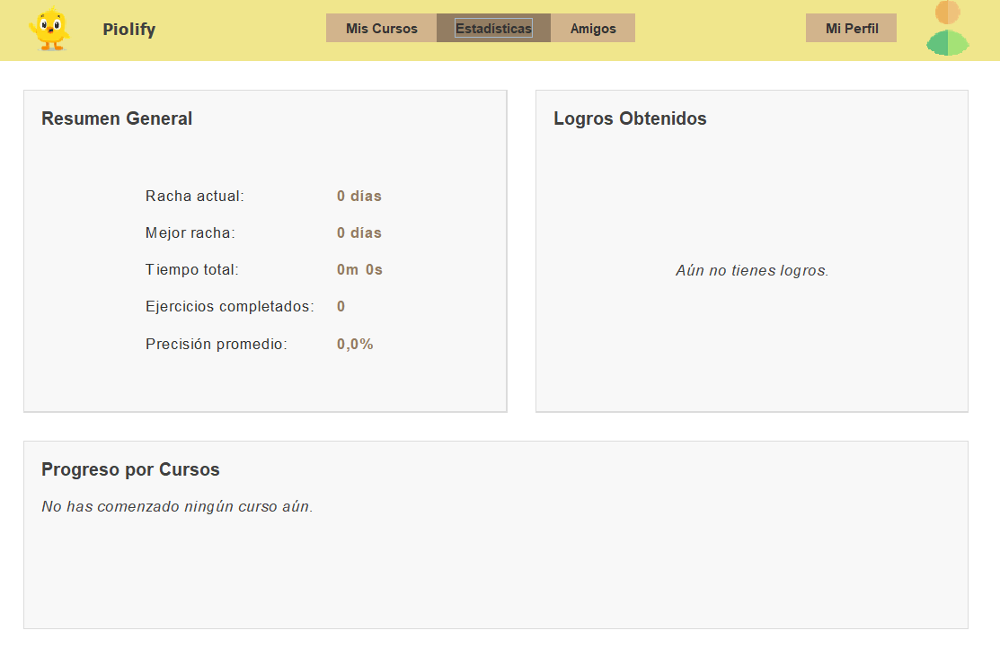

### 👥 Amigos

Permite al usuario interactuar con otros usuarios de la plataforma, permitiendo enviar solicitudes de amistad a partir de su correo electrónico, gestionar solicitudes recibidas y consultar su lista de amigos.

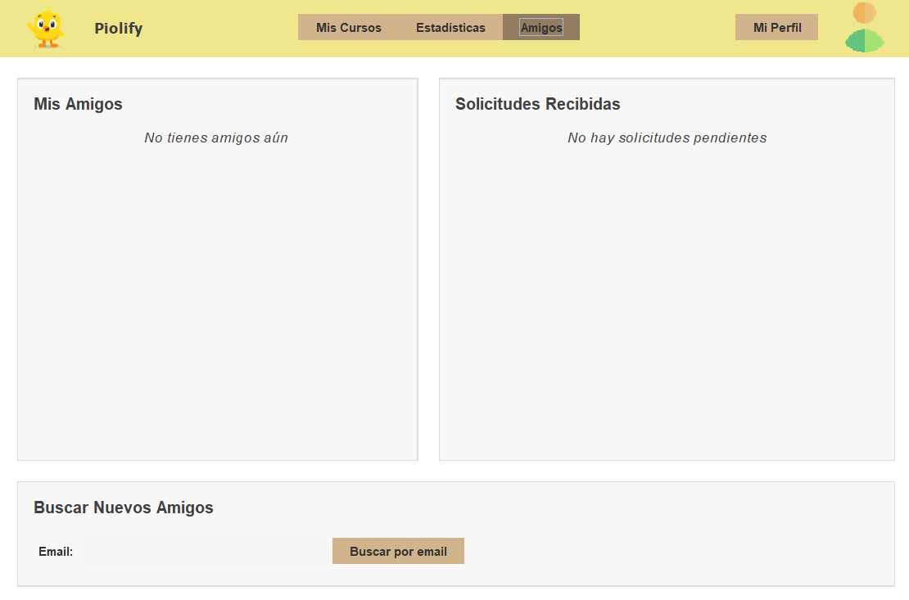

### 👤 Mi perfil

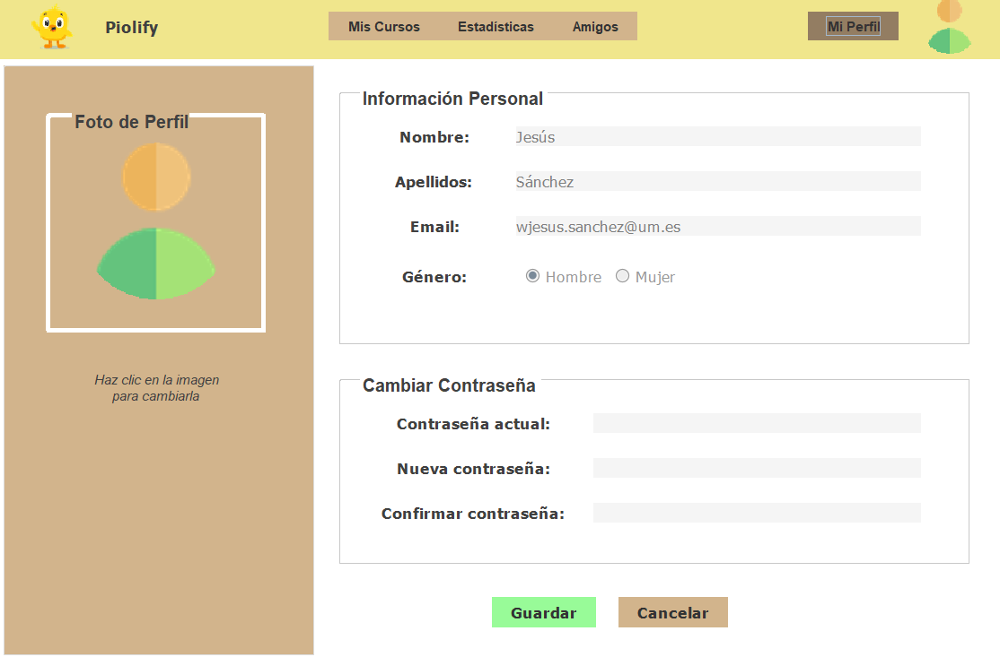

El usuario puede:

- Modificar su información personal (Nombre y Apellidos).
- Cambiar su contraseña. Para ello, se debe escribir la contraseña actual y confirmar la nueva contraseña.
- Elegir una nueva foto de perfil al pulsar su imagen actual. Ofrece dos posibilidades:
  - Insertar un enlace que contenga una imagen.
  - Seleccionar un archivo tipo imagen almacenado localmente.

Una vez seguro de los cambios a realizar, el usuario debe pulsar el botón **Guardar** para que Piolify los aplique. En caso contrario, puede pulsar **Cancelar** para descartar los cambios realizados.

Piolify notificará con un mensaje en pantalla si los cambios solicitados no pueden aplicarse, o si no son válidos, como por ejemplo:

- La contraseña actual introducida es incorrecta.
- Nueva Contraseña y su confirmación no son iguales.
- El archivo seleccionado no es una imagen válida.

## Funcionalidades del sistema

### 📥 Importar Cursos

Para importar un curso, el usuario debe estar en la sección de **Mis Cursos** y pulsar el botón **Importar curso**. Tras ello, se muestra una ventana para que el usuario escoja el archivo .json que contiene el curso que desea importar.

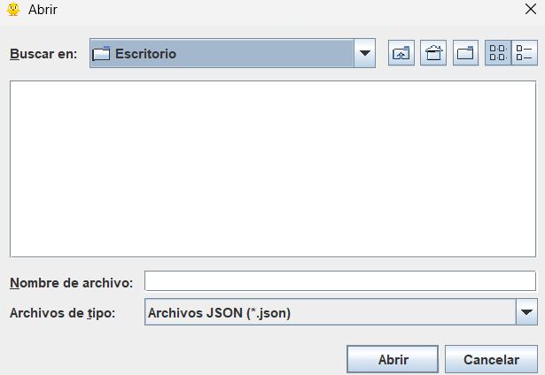

Una vez seleccionado y pulsado el botón **Abrir**, la plataforma verifica si este archivo sigue la estructura correcta. En caso afirmativo, el curso se importará a la plataforma y aparecerá de manera inmediata en la biblioteca interna del usuario. En caso contrario, Piolify notificará mediante un aviso en pantalla del fracaso de la operación.

> En el paquete `src/main/resources` se almacenan varios archivos JSON de ejemplo como referencia del formato que deben seguir para su correcta importación.

<table align="center">
  <tr>
    <td align="center" valign="middle">
      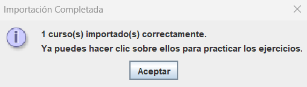
    </td>
    <td align="center" valign="middle">
      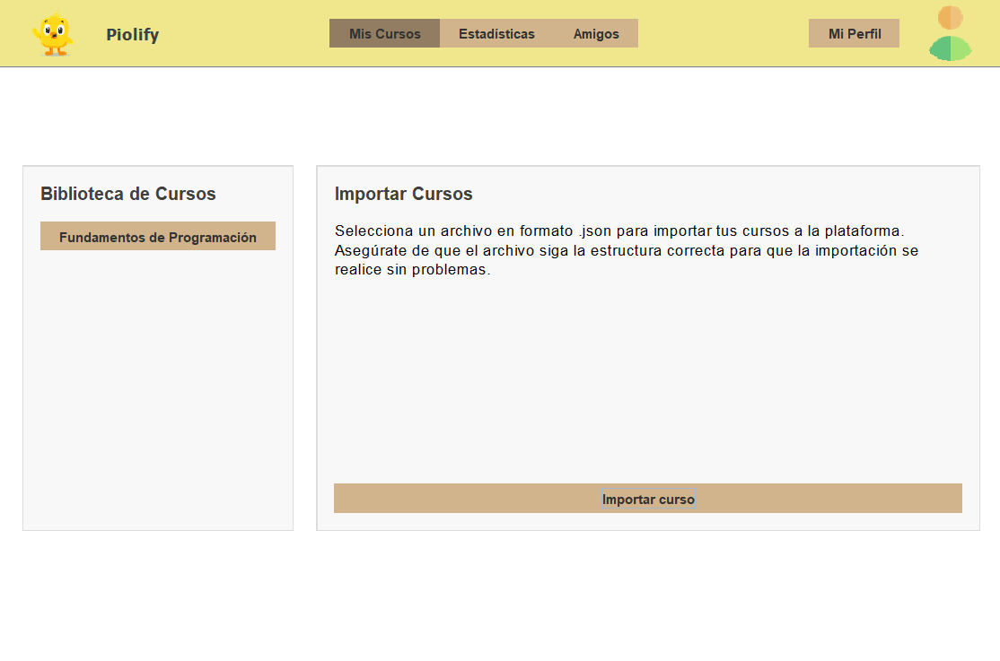
    </td>
  </tr>
</table>

### 🎓 Realizar un curso

Para empezar una sesión de aprendizaje de un curso, se debe pulsar el curso que se quiere realizar mostrado en **Biblioteca de Cursos**. Una vez hecho, Piolify permitirá elegir al usuario el bloque que desea para la sesión, mostrando tanto el progreso general del curso, como el progreso específico para cada curso.

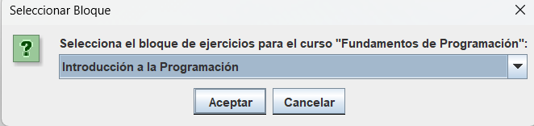

Tras seleccionar el bloque, Piolify permite elegir al usuario la estrategia de aprendizaje que desea para **esa** sesión. Dependiendo de la estrategia, el orden de los ejercicios de la sesión será diferente. Se muestran tres posibilidades:

- **Secuencial**: El orden viene impuesto por el definido en el archivo JSON. Esta es la estrategia por defecto.
- **Repetición espaciada**: Cada tres preguntas como intervalo, se repite una pregunta vista anteriormente (siguiendo un orden secuencial).
- **Aleatoria**: El orden es aleatorio.

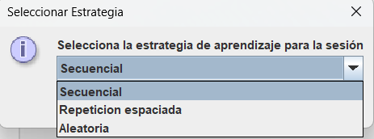

Una vez seleccionado la estrategia, si el usuario dejó una sesión incompleta guardada, Piolify permite:

- **Continuar** la sesión por donde lo dejó la última vez.
- **Cambiar** la estrategia de aprendizaje seleccionada la última vez y continuar desde ese mismo punto.
- **Reiniciar** la sesión desde el principio. Se vuelve a solicitar una estrategia de aprendizaje.
- **Cancelar** la sesión de aprendizaje actual.

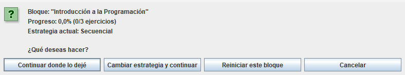

Una vez que el usuario selecciona cómo desea retomar la sesión, se presentan los ejercicios del bloque correspondiente.

- Las preguntas se muestran una a una. El usuario puede retrodecer al ejercicio anterior en cualquier momento, pero para pasar a la siguiente, el usuario debe responder **correctamente** al ejercicio. 
- En el caso de que el usuario se atasque, si se pulsa el botón **Solución** se muestra la respuesta correcta.
- Para que el usuario envíe una respuesta debe pulsar el botón **Validar**, notificando Piolify del acierto o fallo.
- Pueden aparecer diferentes tipos de ejercicios: **Selección Múltiple**, **Completar Huecos** o **Flashcards**.

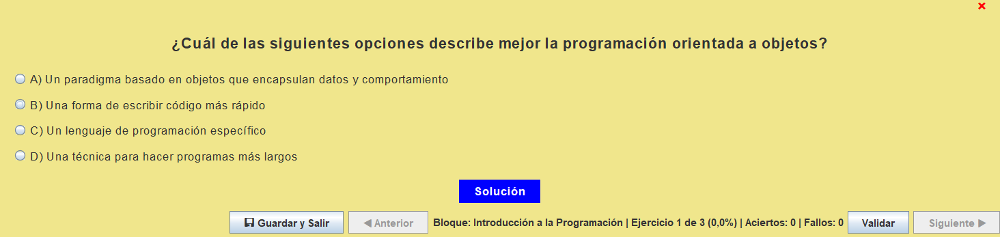

En cualquier momento, durante la sesión, el usuario puede pulsar el botón **Guardar y Salir**, guardando automáticamente el estado actual de la sesión y saliendo de la sesión, pudiendo retomarla posteriormente como se ha explicado anteriormente.

> Si el usuario cierra la ventana sin pulsar el botón **Guardar y Salir**, el progreso de la sesión no se guarda y debera comenzarse desde el inicio la próxima vez. Sin embargo, las estadísticas obtenidas hasta ese momento si quedan registradas en el sistema.

Una vez finalizada la sesión, Piolify muestra un resumen con las estadísticas obtenidas durante esta sesión, incluyendo: Número de ejercicios completados, aciertos, fallos,Precisión de aciertos y tiempo total de la sesión.

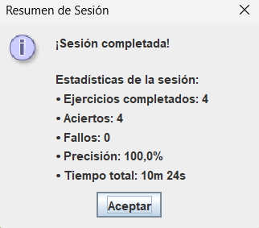

### 📈 Consultar Estadísticas y 🏅 Logros

En esta sección, el usuario puede obtener una visión detallada sobre su desempeño en la plataforma Piolify.

  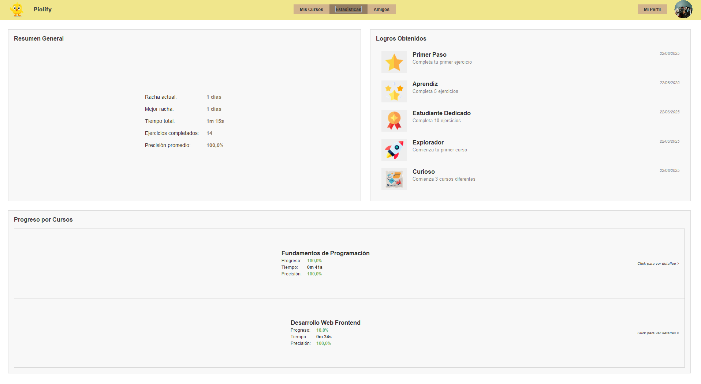

La información se encuentra organizada en tres apartados principales:

  

    <h4>📊 Resumen General</h4>
    <ul>
      <li><strong>Racha actual:</strong> Número de días consecutivos en los que el usuario ha realizado al menos una sesión.</li>
      <li><strong>Mejor racha:</strong> Mayor cantidad de días consecutivos con actividad registrada.</li>
      <li><strong>Tiempo total:</strong> Tiempo total de estudio registrado en todas las sesiones.</li>
      <li><strong>Ejercicios completados:</strong> Total de ejercicios resueltos satisfactoriamente.</li>
      <li><strong>Precisión promedio:</strong> Porcentaje total de aciertos en todos los ejercicios completados.</li>
    </ul>
  

  

    <h4>🏅 Logros Obtenidos</h4>
    <ul>
      <li><strong>Primer Paso:</strong> Completar el primer ejercicio.</li>
      <li><strong>Aprendiz:</strong> Completar 5 ejercicios.</li>
      <li><strong>Estudiante Dedicado:</strong> Completar 10 ejercicios.</li>
      <li><strong>Explorador:</strong> Completar un curso entero.</li>
      <li><strong>Curioso:</strong> Comenzar 3 cursos distintos.</li>
    </ul>
    
Cada logro incluye su nombre, una breve descripción y la <strong>fecha de obtención</strong>.

  

  

    <h4>📚 Progreso por Cursos</h4>
    
Esta sección muestra una lista de todos los cursos realizados por el usuario, junto con su estado de avance. Para cada curso se indica:

    <ul>
      <li><strong>Nombre del curso</strong></li>
      <li><strong>Progreso (%):</strong> Porcentaje completado del contenido del curso.</li>
      <li><strong>Tiempo dedicado:</strong> Tiempo invertido específicamente en ese curso.</li>
      <li><strong>Precisión:</strong> Porcentaje de respuestas correctas.</li>
    </ul>
  

Al hacer clic sobre un curso específico, se abre una ventana emergente con estadísticas detalladas como ejercicios realizados, precisión, dificultad y descripción.

  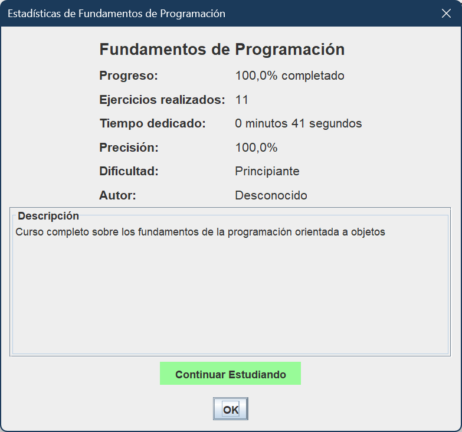

Esto permite al usuario evaluar su progreso en cada curso, identificar fortalezas y debilidades, y decidir dónde enfocar su siguiente sesión de estudio.

### 📩 Enviar solicitudes de amistad

La sección **Amigos** de Piolify permite a los usuarios interactuar socialmente dentro de la plataforma. Desde aquí, se puede buscar a otros usuarios, enviar solicitudes de amistad, aceptar o rechazar solicitudes recibidas, ver la lista de amigos y consultar el perfil de cada uno.

Para enviar una solicitud de amistad:

1. Accede a la sección **Amigos** desde la ventana principal.
2. Introduce el correo electrónico del usuario al que deseas agregar como amigo.
3. Pulsa el botón **Buscar por email**.
4. Si el usuario existe, aparecerá su perfil con la opción de enviarle una solicitud.

  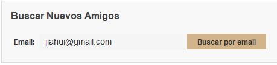
  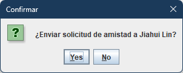

Una vez enviada, la solicitud quedará en estado pendiente hasta que el otro usuario la acepte o rechace.

### 📬 Gestionar solicitudes de amistad

En la misma sección, se pueden gestionar las solicitudes recibidas. Al recibir una solicitud, el sistema mostrará el nombre y correo del remitente, junto con las opciones **Aceptar** o **Rechazar**.

  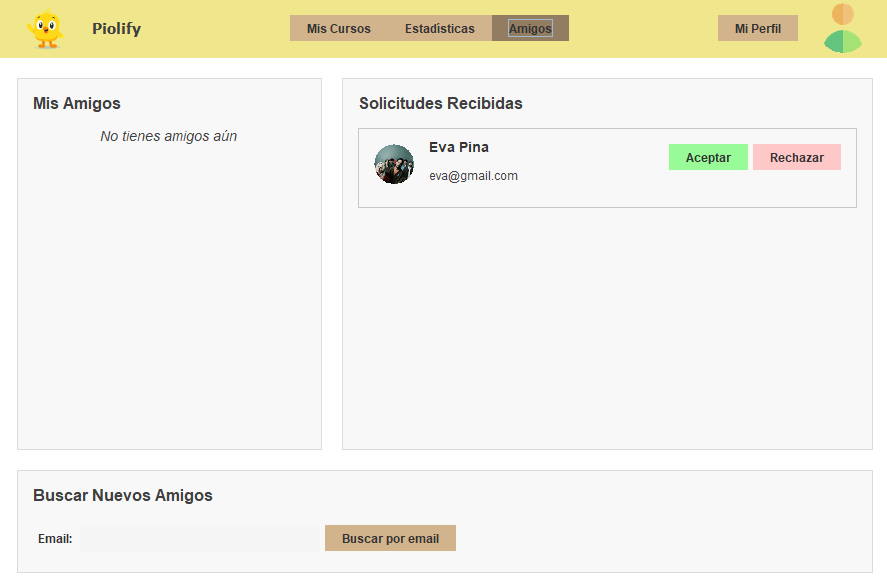

- Si se **acepta** la solicitud, el usuario pasa a formar parte de tu lista de amigos.
- Si se **rechaza**, no se establece ninguna conexión.

Una vez aceptada, ambos usuarios aparecerán en sus respectivas listas de amigos. De esta manera, la plataforma mostrará la lista de contactos disponibles con su nombre, correo electrónico y un botón para **Ver Perfil**.

  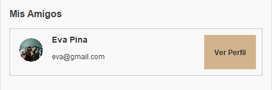
  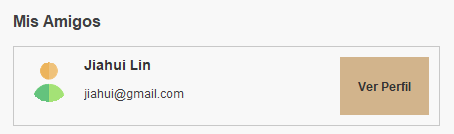

Cada tarjeta de amigo permite acceder a su perfil donde se puede consultar el nombre y correo del usuario, así como sus estadísticas generales y logros obtenidos:

  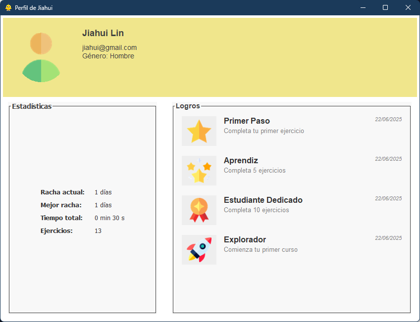

Con estas funciones, Piolify no solo actúa como una plataforma educativa, sino también como una red social académica que motiva a los usuarios a estudiar mediante interacción social y logros compartidos.
