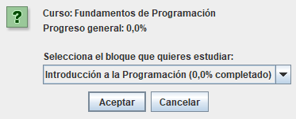

# Manual de Usuario Piolify

## Ejecución

Para iniciar la aplicación, se debe ejecutar la clase `Login`, ubicado en el paquete `umu.pds.vista` del repositorio. Una vez lanzada la aplicación, se muestra la siguiente ventana:  

  

En esta pantalla, el usuario debe introducir sus credenciales (correo electrónico y contraseña) para tener acceso total a la plataforma. Si es la primera vez que ha iniciado la aplicación, lo más probable es que no tenga una cuenta de usuario. Para registrarse en Piolify, se debe pulsar el botón **Registrarse**, redirigiéndolo al formulario de registro.

Para registrarse, debe rellenar todos los campos del formulario y, opcionalmente, proporcionar una foto de perfil. Una vez se haya registrado exitosamente, su cuenta queda registrada y podrá iniciar sesión, a partir de la ventana **Login** mostrada anteriormente.

## Ventana Principal de Piolify

La aplicación se divide en cuatro secciones:

- [**Mis Cursos**](#mis-cursos): Biblioteca interna del usuario.
- [**Estadísticas**](#estadísticas): Consulta de estadísticas y logros obtenidos por el usuario.
- [**Amigos**](#amigos): Sección social de la plataforma.
- [**Mi perfil**](#mi-perfil): Gestión de la información personal del usuario.

### Mis Cursos

Es la sección por defecto al iniciar sesión en Piolify. El usuario es capaz de:

- Importar nuevos cursos en formato  `.json` mediante el botón [**Importar curso**](#importar-cursos).
- Acceder a todos los cursos que ha importado anteriormente. Si no se tienen cursos cargados, se muestra un mensaje por defecto.

### Estadísticas

Permite al usuario visualizar un resumen de su actividad dentro de la plataforma, ideal para un mejor seguimiento del progreso de su aprendizaje. Esta sección muestra:

- Un **Resumen General**, con estadísticas acumuladas de todas las sesiones de aprendizaje realizadas por el usuario. Muestra:
  - La racha actual de días consecutivos completando **al menos** una sesión de aprendizaje.
  - La mejor racha de días consecutivos completando al menos una sesión de aprendizaje.
  - El tiempo total de estudio.
  - El número de ejercicios que ha completado el usuario.
  - El porcentaje promedio de aciertos.
- Los **Logros Obtenidos** por el usuario durante las sesiones de aprendizaje.
- El **Progreso por Cursos**

### Amigos

Permite al usuario interactuar con otros usuarios de la plataforma, permitiendo enviar solicitudes de amistad a partir de su correo electrónico, gestionar solicitudes recibidas y consultar su lista de amigos.

### Mi perfil

El usuario puede:

- Modificar su información personal (Nombre y Apellidos).
- Cambiar su contraseña. Para ello, se debe escribir la contraseña actual y confirmar la nueva contraseña.
- Elegir una nueva foto de perfil al pulsar su imagen actual. Ofrece dos posibilidades:
  - Insertar un enlace que contenga una imagen.
  - Seleccionar un archivo tipo imagen almacenado localmente.

Una vez seguro de los cambios a realizar, el usuario debe pulsar el botón **Guardar** para que Piolify los aplique. En caso contrario, puede pulsar **Cancelar** para descartar los cambios realizados.

Piolify notificará con un mensaje en pantalla si los cambios solicitados no pueden aplicarse, o si no son válidos, como por ejemplo:

- La contraseña actual introducida es incorrecta.
- Nueva Contraseña y su confirmación no son iguales.
- El archivo seleccionado no es una imagen válida.

## Funcionalidades del sistema

### Importar Cursos

Para importar un curso, el usuario debe estar en la sección de **Mis Cursos** y pulsar el botón **Importar curso**. Tras ello, se muestra una ventana para que el usuario escoja el archivo .json que contiene el curso que desea importar.

Una vez seleccionado y pulsado el botón **Abrir**, la plataforma verifica si este archivo sigue la estructura correcta. En caso afirmativo, el curso se importará a la plataforma y aparecerá de manera inmediata en la biblioteca interna del usuario. En caso contrario, Piolify notificará mediante un aviso en pantalla del fracaso de la operación.

> En el paquete `src/main/resources` se almacenan varios archivos JSON de ejemplo como referencia del formato que deben seguir para su correcta importación.

<table align="center">
  <tr>
    <td align="center" valign="middle">
      
    </td>
    <td align="center" valign="middle">
      
    </td>
  </tr>
</table>

### Realizar un curso

Para empezar una sesión de aprendizaje de un curso, se debe pulsar el curso que se quiere realizar mostrado en **Biblioteca de Cursos**. Una vez hecho, Piolify permitirá elegir al usuario la estrategia de aprendizaje que desea para **esa** sesión. Dependiendo de la estrategia, el orden de los ejercicios de la sesión será diferente. Se muestran tres posibilidades:

- **Secuencial**: El orden viene impuesto por el definido en el archivo JSON. Esta es la estrategia por defecto.
- **Repetición espaciada**: Cada tres preguntas como intervalo, se repite una pregunta vista anteriormente (siguiendo un orden secuencial).
- **Aleatoria**: El orden es aleatorio.

Una vez seleccionado, a continuación la plataforma pregunta al usuario que bloque del curso desea realizar.

Tras seleccionar el bloque, Piolify inicia automáticamente la sesión de aprendizaje. Durante la sesión:

- Las preguntas se muestran una a una. El usuario puede retrodecer al ejercicio anterior en cualquier momento, pero para pasar a la siguiente, el usuario debe responder **correctamente** al ejercicio. Es por ello que, en caso de que el usuario se atasque, si se pulsa el botón **Solución** se muestra la respuesta correcta.
- Para que el usuario envíe una respuesta debe pulsar el botón **Validar**, notificando Piolify del acierto o fallo.
- Pueden aparecer diferentes tipos de ejercicios: **Selección Múltiple**, **Completar Huecos** o **Flashcards**.

Una vez finalizada la sesión, Piolify muestra un resumen con las estadísticas obtenidas durante esta sesión, incluyendo: Número de ejercicios completados, aciertos, fallos,Precisión de aciertos y tiempo total de la sesión.

> Si el usuario cierra la ventana de la sesión antes de completarla, no se guarda la sesión por lo que deberá comenzar desde el principio la próxima vez. No obstante, sus estadísticas quedaron registradas en el sistema.

### Consultar Estadísticas y Logros

### Enviar solicitudes de amistad

### Gestionar solicitudes de amistad