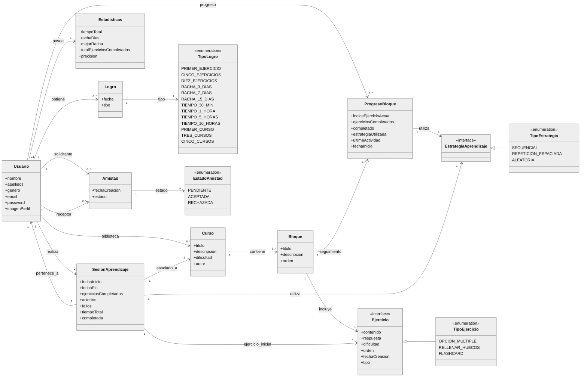

# Modelo de Dominio de Piolify

A continuación se presenta el diagrama de clases que representa el modelo de dominio de nuestra aplicación:

```mermaid
%%{ init: {"theme": "neutral"} }%%
classDiagram

    EstrategiaAprendizaje <|-- TipoEstrategia
    Ejercicio <|-- TipoEjercicio

    direction LR
    
    class Usuario {
        +nombre
        +apellidos
        +genero
        +email
        +password
        +imagenPerfil
    }
    
    class Curso {
        +titulo
        +descripcion
        +dificultad
        +autor
    }
    
    class Bloque {
        +titulo
        +descripcion
        +orden
    }
    
    class Ejercicio {
        <<interface>>
        +contenido
        +respuesta
        +dificultad
        +orden
        +fechaCreacion
        +tipo
    }
    
    class SesionAprendizaje {
        +fechaInicio
        +fechaFin
        +ejerciciosCompletados
        +aciertos
        +fallos
        +tiempoTotal
        +completada
    }
    
    class ProgresoBloque {
        +indiceEjercicioActual
        +ejerciciosCompletados
        +completado
        +estrategiaUtilizada
        +ultimaActividad
        +fechaInicio
    }
    
    class EstrategiaAprendizaje {
        <<interface>>
    }
    
    class Estadisticas {
        +tiempoTotal
        +rachaDias
        +mejorRacha
        +totalEjerciciosCompletados
        +precision
    }

    class Amistad {
        +fechaCreacion
        +estado
    }
    
    class TipoLogro {
        <<enumeration>>
        PRIMER_EJERCICIO
        CINCO_EJERCICIOS
        DIEZ_EJERCICIOS
        RACHA_3_DIAS
        RACHA_7_DIAS
        RACHA_15_DIAS
        TIEMPO_30_MIN
        TIEMPO_1_HORA
        TIEMPO_5_HORAS
        TIEMPO_10_HORAS
        PRIMER_CURSO
        TRES_CURSOS
        CINCO_CURSOS
    }

    class Logro {
        +fecha
        +tipo
    }

    class EstadoAmistad {
        <<enumeration>>
        PENDIENTE
        ACEPTADA
        RECHAZADA
    }

    class TipoEjercicio {
        <<enumeration>>
        OPCION_MULTIPLE
        RELLENAR_HUECOS
        FLASHCARD
    }

    class TipoEstrategia {
        <<enumeration>>
        SECUENCIAL
        REPETICION_ESPACIADA
        ALEATORIA
    }

    
    %% Relaciones
    Usuario "1" --> "0..*" Amistad : solicitante
    Usuario "1" --> "0..*" Amistad : receptor
    Usuario "1" --> "0..*" Logro : obtiene
    Usuario "1" --> "0..*" Curso : biblioteca
    Usuario "1" --> "1" Estadisticas : posee
    Usuario "1" --> "0..*" SesionAprendizaje : realiza
    Usuario "1" --> "0..*" ProgresoBloque : progreso
    
    Curso "1" --> "1..*" Bloque : contiene
    Bloque "1" --> "1..*" Ejercicio : incluye
    Bloque "1" --> "0..*" ProgresoBloque : seguimiento
    
    ProgresoBloque "1" --> "1" EstrategiaAprendizaje : utiliza
    
    SesionAprendizaje "1" --> "1" Usuario : pertenece_a
    SesionAprendizaje "1" --> "1" Curso : asociado_a
    SesionAprendizaje "1" --> "1" Ejercicio : ejercicio_inicial
    SesionAprendizaje "1" --> "1" EstrategiaAprendizaje : utiliza
    
    Logro "1" --> "1" TipoLogro : tipo
    
    Amistad "1" --> "1" EstadoAmistad : estado

```
